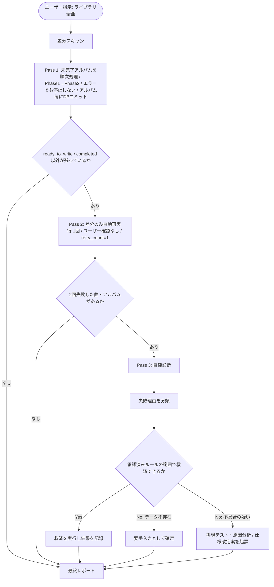

# LyricNote 詳細仕様書 (v2.1)

## 改定履歴 (Change Log & Traceability)

| バージョン | 改定日時 | 改定者 | 改定理由・経緯 | 主な変更内容 | 旧版アーカイブ |
| :--- | :--- | :--- | :--- | :--- | :--- |
| v1.0 | 2026-10-04 | Assistant | 初版ドラフト | iTunes COM連携、LRCLIB、Geminiプロンプト、Gemma2和訳の基本設計 | [`specs/archive/architecture_spec_initial_draft.md`](archive/architecture_spec_initial_draft.md) |
| v1.1 | 2026-10-05 01:00 | Assistant | セキュリティ再評価・スキャン仕様適正化 | Gradio Share却下・Tailscale必須化／全曲自動スキャン・邦楽和訳自動スキップ | [`specs/archive/architecture_spec_v1.0_20261005.md`](archive/architecture_spec_v1.0_20261005.md) |
| v2.0 | 2026-10-05 08:30 | Assistant | 実機不具合（各曲解説脱落・邦楽歌詞取得失敗・Ollama切断）の根本解決 | 解説スキーマ分離、`tracks.liner_notes`永続化、LRCLIB多段階検索、Ollama安定化、7セクション化 | [`specs/archive/architecture_spec_v2.0_20261005.md`](archive/architecture_spec_v2.0_20261005.md) |
| **v2.1** | 2026-10-05 12:40 | Assistant | ①ユーザー手間削減のため解説生成をエージェント全自動化 ②ライブラリ全曲の無停止処理と自律診断 ③基本方針・既存仕様の復元統合 | 第0章（基本方針）の復元・固定／Phase1-2全自動化・Phase3ユーザー承認制／2パス自動実行＋自律診断／ステータス体系統一 | （本ドキュメント） |

**v2.0からの復元項目**: 目的と目標（原文）、絶対遵守ルール章、API課金ゼロ、SDD・検証エビデンス義務、Gradio Share却下の評価根拠、ライブラリスキャン仕様、翻訳メモリ・用語集注入、辞典化（永続蓄積）、歌詞未取得時の手動入力。

---

## 第0章 プロジェクト基本方針（不変事項）

> 本章はプロジェクトオーナーの意図そのものであり、改定時も原則として変更しない。変更する場合は理由を明記し、オーナー承認を必須とする。

### 0.1. プロジェクトの目的と目標（Why）
**「言葉の壁を越え、アーティストが楽曲・アルバムに込めた真のメッセージや物語を深く理解し、手持ちの洋楽・邦楽ライブラリでの音楽鑑賞体験を極限まで豊かにすること」**

本ツールは単なる直訳ツールではない。プログレやロックオペラなど、アルバム全体を通したテーマ性や架空のキャラクター、ダブルミーニング・造語などを正確に読み解き、一貫した世界観を持った「和訳」と「ライナーノーツ（アルバム全体解説＋各曲ごとの個別楽曲解説）」を生成・付与することで、ユーザーに深い音楽鑑賞の喜びを提供することを最終目標とする。

- **洋楽**: 歌詞取得＋世界観を踏まえた和訳＋楽曲解説＋アルバム解説。
- **邦楽**: 和訳は不要。WEBからの歌詞取得＋楽曲解説＋アルバム解説のみ。ユーザーに洋楽/邦楽の選択を求めない。
- **ライブアルバム**: 歌詞解釈よりも、ツアー背景・動員・録音場所・メンバー編成などライブとしての価値を重視した解説。

### 0.2. 絶対遵守ルール（Safety & Limits）
1. **データアクセス制限**: DB・キャッシュ・バックアップ等は `X:\LylicData` 配下のみ。SSD摩耗・クラウド同期汚染を避けるため、それ以外への書き込みは違反とする。
2. **楽曲ファイルの保護**: `track.Delete()`・`os.remove()` 等による音楽ファイルの物理削除・バイナリ改変を絶対禁止。メタデータ更新は iTunes COM API の `Lyrics` プロパティ代入のみ。
3. **API課金リスクの排除（追加課金ゼロ）**:
   - 解説生成は、エージェント自身の推論リソース（追加課金なし）を標準とする。
   - Gemini API を利用する場合は無料枠を超えないよう、Rate Limit（429 / RESOURCE_EXHAUSTED）を検知した時点で即停止する。
   - **手動ハイブリッドモード**（プロンプトのコピー → ブラウザのGemini Advanced → JSONを貼り付け）は、代替手段として残す。
4. **iTunes書き込みの主権はユーザーにある（v2.1追加）**: エージェントや自動バッチが iTunes に書き込むことを禁止する。iTunes への反映は、ユーザーが WebUI で明示的に操作したときに限る。
5. **仕様駆動開発（SDD）と検証エビデンスの義務**:
   - コードを変更する前に、仕様書の改定案を提示してオーナー承認を得る。承認前に仕様書本体を書き換えない。
   - 仕様書を大きく書き換えるときは、旧版を `specs/archive/` に退避してから行う（トレーサビリティ確保）。
   - 実装したら自律的にテスト・検証を行い、生ログ付きで `TEST_EVIDENCE.md` に記録してから報告する。

### 0.3. インフラ・アクセス設計とセキュリティ要件
1. **リスク評価**: 本システムは iTunes COM API とローカルファイルシステムを操作する権限を持つため、インターネットからの不正アクセスは重大な情報漏洩・システム破壊につながる。
2. **Gradio Share の却下**: 公開URL（`*.gradio.live`）と Gradio の Basic 認証には、レートリミット・アカウントロック・MFA がなく、総当たり攻撃に弱い（OWASP 非推奨）。Gradio 自体の脆弱性リスクもある。このため `--share` と Basic 認証は**実装しない**。
3. **待ち受け**: `server_name="0.0.0.0"`, `port=7860`（ローカル／LAN 限定）。
4. **外出先からの接続**: Tailscale 等の暗号化メッシュVPN（WireGuard 基盤、SSO + MFA）を必須ガイドラインとする。運用上の注意として、認証アカウントの2段階認証を有効にすることと、接続端末をロックしておくことを守る。

---

## 1. 背景と目的 (Background & Objective)

### 1.1. 背景
- v1.0〜v2.0 で、スキャン・解説・歌詞取得・和訳・iTunes 書き込みの一連の機能が揃った。
- 一方で、実際の運用で次の負担が明らかになった。
  1. ブラウザの Gemini へプロンプトを転記し、出力を貼り戻す作業を、アルバムの枚数分くり返さなければならない。
  2. アルバム単位の細切れ実行では、ライブラリ全曲（約8,500曲・約500アルバム）を処理しきれない。
  3. エラーや歌詞空白が出ると処理が止まったり、ユーザーが手作業で再実行したりしなければならない。

### 1.2. 目的（v2.1 で追加）
- 第0章の目的を達成するため、**解説生成（Phase 1）と歌詞取得・和訳（Phase 2）をエージェントが全自動で実行**し、ユーザーの手間をなくす。
- 「ライブラリ全曲」の指示1回で、エラーがあっても止まらずに最後まで走り切る。偶発的なエラーは自動の再実行で解消し、2回失敗した曲は自律診断で原因まで特定する。
- iTunes への反映（Phase 3）はユーザーの意思で行う（第0章 0.2-4）。エラーや未完成のデータが iTunes に入らないことを構造的に保証する。

---

## 2. ユースケース / ユーザーストーリー (Use Cases)

### UC-1: ライブラリ全曲の一括処理（標準運用）
1. ユーザーがチャットで「ライブラリ全曲を処理して」と指示する。
2. エージェントが iTunes ライブラリの差分スキャンを行う。
3. **Pass 1**: 未完了のアルバムを順に処理する。中身は Phase 1（解説生成 → DB保存）と Phase 2（歌詞取得 → 洋楽のみ和訳 → DB保存）。エラーが出ても止まらない。
4. **Pass 2**: 失敗した曲・アルバムだけを、確認を取らずに自動で1回だけ再実行する。
5. **Pass 3**: 2回失敗した曲を抽出し、自律診断する（原因の分類、承認済みルールの範囲内での救済、レポート作成）。
6. エージェントが最終レポートを提示する。
7. ユーザーが WebUI でプレビューを確認し、必要なら修正したうえで iTunes へ書き込む（Phase 3）。

### UC-2: 洋楽スタジオアルバム（例: Asia『Asia』）
- 用語集・世界観を踏まえた和訳と、各曲解説・アルバム解説を書き込む。
- 書き込み内容は【Original Lyrics】＋【和訳】＋【楽曲解説: 曲名】＋【アルバム解説】。

### UC-3: 邦楽アルバム（例: THE ALFEE）
- 表記揺れがあっても、正規化検索で歌詞を取得する。和訳は自動でスキップする。
- 書き込み内容は【歌詞】＋【楽曲解説: 曲名】＋【アルバム解説】。

### UC-4: ライブアルバム
- アルバム名に Live / Tour / Budokan などが含まれる場合は、ライブ専用の解説方針に切り替える（第0章 0.1）。

### UC-5: 歌詞がWEBに存在しない曲
- 自律診断で「WEB上に歌詞なし」と確定した曲は、iTunes 書き込みの対象から自動で外す。
- ユーザーは WebUI で歌詞を手入力でき、入力すると書き込み可能になる。

### UC-6: 辞典閲覧
- 蓄積したアルバム解説・楽曲解説は削除せずに永続保存し、WebUI の「ライナーノーツ辞典」タブからいつでも読めるようにする。

### UC-7: 手動ハイブリッドモード（代替手段）
- エージェントを使わない場合は、従来どおり WebUI でプロンプトをコピーし、JSON を貼り付けて解説を適用できる。

---

## 3. 影響範囲 (Impact Scope)

| モジュール | 変更内容 | 区分 |
| :--- | :--- | :--- |
| `src/db.py` | ステータス体系の統一、リトライ・診断カラム追加（マイグレーション）、差分抽出クエリ、`update_track_liner_notes` | 変更 |
| `src/critic.py` | 解説JSONの検証関数（必須キー、全曲分の解説があるか）を追加。プロンプト生成は手動モード用に維持 | 変更 |
| `src/lyrics_fetcher.py` | 正規化＋多段階検索（v2.0 仕様）、失敗理由コードの返却 | 変更 |
| `src/translator.py` | v2.0 の安定化仕様（`num_ctx` 4096、3回リトライ）＋失敗理由コードの返却 | 変更 |
| `src/itunes_writer.py` | 統合フォーマッタ（v2.0 仕様）、書き込み前の `ready_to_write` 判定 | 変更 |
| `src/batch_runner.py` | Phase 2 と Pass 1〜3 の制御、チェックポイント、レポート出力 | **新規** |
| `src/app.py` | Phase 3 専用の確認・書き込みコンソール化（ステータス表示、Ready のみ一括書き込み、手入力）、辞典タブ・手動モードは維持 | 変更 |

- **破壊的変更**: なし。DB には列を追加するだけで、既存データは保持する。既存のステータス値は新しい体系へ対応付けて移行する（4.1）。

---

## 4. 仕様詳細 (Specification Details)

### 4.1. データモデル

```sql
-- tracks: 既存列は v2.0 のまま維持し、以下を追加
ALTER TABLE tracks ADD COLUMN retry_count INTEGER DEFAULT 0;      -- バッチレベルの試行回数（Pass単位）
ALTER TABLE tracks ADD COLUMN last_error TEXT;                    -- 最新エラー内容
ALTER TABLE tracks ADD COLUMN error_phase TEXT;                   -- 'critic' | 'lyrics' | 'translation'
ALTER TABLE tracks ADD COLUMN diagnostic_result TEXT;             -- 自律診断の分類コード（4.4）
ALTER TABLE tracks ADD COLUMN lyrics_source TEXT;                 -- 'itunes' | 'lrclib_get' | 'lrclib_search' | 'manual'

-- albums: 以下を追加
ALTER TABLE albums ADD COLUMN critic_status TEXT DEFAULT 'pending'; -- 'pending' | 'done' | 'failed'
ALTER TABLE albums ADD COLUMN critic_source TEXT;                   -- 'agent' | 'manual' | 'api'

-- 実行履歴（トレーサビリティ）
CREATE TABLE IF NOT EXISTS batch_runs (
    run_id TEXT PRIMARY KEY,
    started_at TIMESTAMP, finished_at TIMESTAMP,
    pass_no INTEGER,                 -- 1, 2, 3
    target_count INTEGER, success_count INTEGER, failed_count INTEGER,
    report_path TEXT                 -- X:\LylicData\reports\ 配下
);
```

**統一ステータス（tracks.status）**

| ステータス | 意味 | iTunes書き込み |
| :--- | :--- | :--- |
| `unprocessed` | 未処理 | 不可 |
| `lyrics_not_found` | 歌詞取得失敗 | 不可 |
| `translation_failed` | 和訳失敗（洋楽） | 不可 |
| `ready_to_write` | 歌詞＋（洋楽なら和訳）が揃い、エラー文字列なし | **可** |
| `completed` | iTunes書き込み済み | 再書き込み可 |

- 既存値の移行: `lyrics_found` / `translated` は検証後に `ready_to_write` へ移行する。和訳欄にエラー文字列（`【翻訳エラー`）を含む行は `translation_failed` へ移行する。
- 解説（Phase 1）の失敗はアルバム単位で `albums.critic_status` に記録する。解説がなくても歌詞・和訳は書き込めるため、トラックの書き込み可否とは切り離す（解説がなければ該当ブロックを省略、4.6）。

### 4.2. Phase 1: 解説生成（エージェント実行）
- **実行主体**: エージェント（自身の推論リソース。追加課金なし）。手動ハイブリッドモードとGemini API（無料枠のみ）は代替手段として残す。
- **入力**: アーティスト、アルバム、収録曲名リスト（メタデータのみ。歌詞本文は送らない＝著作権配慮）。
- **方針**: 公式インタビュー・信頼性の高い音楽誌・バイオグラフィに基づく。推測で書かない。ライブアルバムはライブ専用方針（第0章 0.1）。
- **出力スキーマ**: v2.0 の 4.2 を変更せず継承（`is_live` / `album_overview` / `story_and_characters` / `track_commentaries` / `glossary`）。
- **保存前の検証**: 必須キーがそろっていること、`track_commentaries` が全収録曲を網羅していること、JSON として正しいこと。不足があれば `critic_status='failed'` と理由を記録する。
- **保存**: v2.0 の 4.3（曲名の正規化照合 → `tracks.liner_notes`、`albums.liner_notes`、`albums.context_json`）を継承する。
- **用語集の和訳への注入**: `glossary` と `story_and_characters` を Gemma2 のシステムプロンプトに動的に組み込み、アルバム単位で一貫した和訳にする（v1.0 から継承）。このため、洋楽の和訳は Phase 1 が完了したアルバムから実行する。

### 4.3. Phase 2: 歌詞取得・和訳（バッチ実行）
- **歌詞取得**: v2.0 の 4.4（iTunes 既存歌詞 → LRCLIB get → 正規化 search）を継承し、取得元を `lyrics_source` に記録する。
- **言語判定と邦楽スキップ**: v1.1 から継承。`language='ja'` は和訳をスキップする。
- **和訳**: v2.0 の 4.5（gemma2:9b、`num_ctx` 4096、temperature 0.3、通信エラー時の3回リトライ）を継承する。
- **翻訳メモリ**: 正規化した歌詞の SHA-256 で照合し、重複曲（ベスト盤など）は過去の和訳を即時に適用する（v1.0 から継承）。
- **エラー文字列の混入防止**: 和訳結果がエラー表現を含む場合や空の場合は、`translated_lyrics` に保存しない。`translation_failed` と `last_error` を記録する。

> [!NOTE]
> **リトライは2層構造**: (a) リクエスト単位 = Ollama通信の即時3回リトライ（v2.0）。(b) バッチ単位 = Pass 2 による差分再実行（v2.1）。`retry_count` は (b) のみを数える。

### 4.4. 全曲バッチ: 2パス自動実行と自律診断



- **Pass 1**: 処理単位はアルバム。1枚終わるごとに DB にコミットする（チェックポイント）。中断しても、次回は未完了分から自動で再開する。
- **Pass 2**: Pass 1 が終わったら自動で開始する。対象は `status NOT IN ('ready_to_write','completed')` の曲と、`critic_status='failed'` のアルバム。**1回だけ**実行する。
- **Pass 3（自律診断）**: 2回失敗した対象ごとに、次の調査を自律的に完了させる。
  1. **分類**: `diagnostic_result` に次のいずれかを記録する。
     - `not_in_lrclib`（WEB上に歌詞なし）
     - `query_mismatch`（表記揺れで取れない）
     - `instrumental`（インスト曲）
     - `translation_model_error`（和訳モデル側のエラー）
     - `input_anomaly`（歌詞が極端に長い、形式が異常など）
     - `critic_incomplete`（解説の生成が不完全）
     - `bug_suspected`（不具合の疑い）
  2. **救済（自己修復）**: **承認済み仕様の範囲内だけ**で行う。例として、正規化ルール（v2.0 の 4.4）を組み合わせた追加クエリ、曲単位での個別再試行、解説の再生成がある。
  3. **不具合の疑い**: 対象曲で再現テストを行い、ログを採取し、原因を分析する。修正にコード変更が必要な場合は、勝手に直さず、診断結果と修正案（仕様改定案）を作ってレポートに載せる（第0章 0.2-5 との整合）。
- **最終レポート**: `X:\LylicData\reports\` に保存し、チャットでも提示する。内容は次のとおり。
  - 全体件数（成功数・救済数・残りの件数）
  - 診断結果の分類ごとの内訳
  - 救済の内容
  - 手入力が必要な曲の一覧
  - 不具合の疑いがある曲と、その修正案

### 4.5. Phase 3: 確認・iTunes書き込み（ユーザー操作のみ）
- WebUI の役割は「最終確認・反映コンソール」。アルバム一覧にステータスを表示する（例: `Ready 8/10・歌詞なし 2`）。
- 書き込み対象は `ready_to_write` と `completed` の曲だけ。それ以外の曲は iTunes に一切触れずに除外し、除外した件数と理由を表示する。
- 書き込み前に、元の歌詞を `X:\LylicData\lyrics_backup\{PID}.json` に退避する。復元機能は維持する（v1.0 から継承）。
- プレビュー画面で、和訳・解説の手修正と、歌詞の手入力（UC-5）ができる。
- 辞典タブ（UC-6）と手動ハイブリッドモード（UC-7）は維持する。

### 4.6. iTunes歌詞欄の統合フォーマット
- v2.0 の 4.6 を変更せずに継承する（洋楽 / 邦楽の2形式。解説がない場合はそのブロックを省略）。

### 4.7. ライブラリスキャン（v1.1 から復元）
- 音声トラックだけを対象に、全曲を自動スキャンする。洋楽/邦楽の選択はユーザーに求めない。
- ビデオ・Podcast・PDF、および曲名/アーティスト/アルバム名が空のトラックはスキップする。
- iTunes に既存の歌詞があれば検知して DB に保存する。
- PID の取得には `itunes.ITObjectPersistentIDHigh/Low(track)`、検索には `ItemByPersistentID` を使う。

---

## 5. 非機能要件・制約事項
1. 第0章 0.2（絶対遵守ルール）と 0.3（セキュリティ）をすべて満たす。
2. **長時間の無人稼働**:
   - アルバムごとに2秒の冷却を入れる。
   - 10アルバムごとにメモリを解放する。
   - スリープや再起動で中断しても、チェックポイントから再開できる。
3. **エージェント実行の継続性**:
   - 全曲（約500アルバム）の解説生成はエージェントの複数ターンにまたがる。このため進捗は会話ではなく **DB で管理**する。
   - 会話が途切れても、「続きを処理して」の一言で、未完了のアルバムから再開できる。
4. iTunes の歌詞フィールドの文字数上限（32,768文字）を検証する。
5. 解説の品質: 推測を書かない方針に従う。自信度が低いアルバムはレポートで明示する。

---

## 6. 受入基準・検証手順 (DoD)
生ログを `TEST_EVIDENCE.md` に記録することが、各項目の完了条件。

- [ ] DoD-1〜5: v2.0 の DoD-1〜5 を継承する（個別解説の永続化／表記揺れの吸収／邦楽歌詞の取得／書き込みフォーマット／Ollama のリトライ）。
- [ ] DoD-6（2パス自動実行）: 失敗を意図的に混ぜても Pass 1 が止まらずに走り切り、Pass 2 が自動で1回だけ差分を再実行すること。
- [ ] DoD-7（チェックポイント再開）: 処理を途中で強制終了しても、再実行すると完了済みのアルバムを処理し直さないこと。
- [ ] DoD-8（自律診断）: 2回失敗した曲に診断の分類が付くこと。救済できるものは救済され、`bug_suspected` には再現ログと修正案が付くこと。
- [ ] DoD-9（iTunes 書き込みの防壁）: `ready_to_write` 以外の曲が iTunes に書き込まれないこと。エラー文字列を含むデータが `ready_to_write` にならないこと。
- [ ] DoD-10（基本方針の遵守）: `X:\LylicData` 以外への書き込みがないこと。楽曲の削除 API の呼び出しがないこと。エージェント・バッチから iTunes への書き込み経路がないこと。いずれもコード検査とテストで確認する。
- [ ] DoD-11（リグレッション）: 辞典タブ、手動ハイブリッドモード、翻訳メモリ、邦楽スキップ、ライブアルバム判定が引き続き動くこと。
- [ ] DoD-12（エビデンス）: すべてのテストについて、コマンド・入力・生ログが `TEST_EVIDENCE.md` に虚偽なく記録されていること。

---

## 7. タスク分解（原則1ファイル1タスク）
1. `src/db.py`: スキーマ追加とマイグレーション（既存ステータスの移行を含む）、差分抽出、`update_track_liner_notes`。
2. `src/critic.py`: 解説 JSON の検証関数。
3. `src/lyrics_fetcher.py`: 正規化＋多段階検索、失敗理由コード。
4. `src/translator.py`: エラー文字列を保存しないことの徹底、失敗理由コード。
5. `src/itunes_writer.py`: 統合フォーマッタ、書き込み前の `ready_to_write` 判定。
6. `src/batch_runner.py`（新規）: Pass 1〜3、チェックポイント、`batch_runs` の記録、レポート出力。
7. `src/app.py`: Phase 3 コンソール化（ステータス表示、Ready のみの一括書き込み、手入力）。
8. `tests/`: DoD-1〜11 のテストスイート。
9. `TEST_EVIDENCE.md`: 生ログの記録と完了報告。
10. `USER_GUIDE.md`: エージェント運用手順（指示の仕方、再開方法、Phase 3 の操作）の追記。

---

## 承認済み設計事項（合意内容）
1. **Pass 3 の自己修復の範囲**: 救済は「承認済み仕様の範囲内の再試行・クエリの組み合わせ」までとし、コード修正が必要な不具合は「診断と修正案の提示」にとどめる（SDD規約遵守）。
2. **手動ハイブリッドモード・Gemini API**: 代替手段として維持する。
3. **解説生成の処理量と継続性**: 約500アルバムの解説生成は複数回の会話にまたがるため、進捗をDB管理とし、中断時は「続きを処理して」で未完了分から再開する運用とする。
