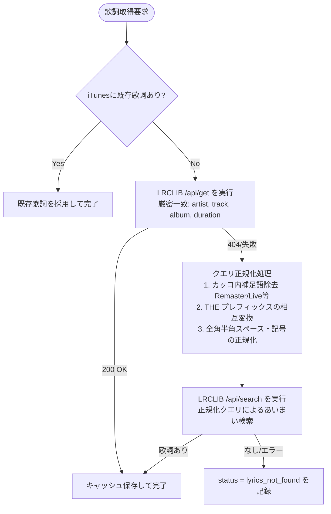

# LyricNote: iTunes 楽曲解説・和訳・ライナーノーツ付与システム 詳細仕様書 (v2.0)

## 改定履歴 (Change Log & Traceability)

| バージョン | 改定日時 | 改定者 | 改定理由・経緯 | 主な変更内容 | 旧版アーカイブ |
| :--- | :--- | :--- | :--- | :--- | :--- |
| **v1.0** | 2026-10-04 | Assistant | 初版ドラフト作成 | ・iTunes COM連携、LRCLIB歌詞取得、Geminiプロンプト、Gemma2和訳の基本設計 | [`specs/archive/architecture_spec_initial_draft.md`](specs/archive/architecture_spec_initial_draft.md) |
| **v1.1** | 2026-10-05 01:00 | Assistant | セキュリティ再評価およびスキャン仕様の適正化 | ・Gradio Shareの脆弱性評価に基づき外部公開（`--share`）を不採用・削除し、Tailscale VPNを必須ガイドラインに設定<br>・洋楽/邦楽の選択モードを撤廃し、全曲自動スキャン＆邦楽和訳の自動スキップへ統一 | [`specs/archive/architecture_spec_v1.0_20261005.md`](specs/archive/architecture_spec_v1.0_20261005.md) |
| **v2.0** | 2026-10-05 08:30 | Assistant | 実機検証での不具合（各曲解説の脱落、邦楽歌詞の取得失敗、Ollama通信切断）の根本解決 | ・Gemini出力スキーマに `album_overview` と `track_commentaries` を正式分離定義<br>・各曲解説を `tracks.liner_notes` にPersistent ID単位で確実に永続化保存するデータフローを新設<br>・邦楽歌詞取得のため、LRCLIBの表記揺れ正規化・多段階検索フォールバックを仕様化<br>・OllamaのVRAM保護（`num_ctx: 4096`）および指数バックオフ自動リトライを仕様化<br>・iTunes歌詞欄の書き込みフォーマットを再定義（各曲解説＋全体解説の統合）<br>・`10-spec-format.md` に完全準拠した7セクション構成へ再編 | （本ドキュメント） |

---

## 1. 背景と目的 (Background & Objective)

### 1.1. 背景
iTunes/Apple Musicのライブラリに蓄積された洋楽・邦楽資産に対し、「言葉の壁」や「背景知識の不足」により、アーティストがアルバムや楽曲に込めた真のテーマや物語を味わい尽くせていないという課題がある。
先行開発（v1.0〜v1.1）において、ライブラリ全体の自動スキャンとアルバム全体の解説生成は実現したが、実機検証において以下の2点の重大な課題が顕在化した。
1. **各曲解説の脱落**: アルバム全体のライナーノーツのみが全曲に一律適用され、楽曲個別のエピソードや解釈がiTunesに書き込まれない。
2. **邦楽歌詞の取得失敗**: THE ALFEE等の邦楽アルバムにおいて、アーティスト名や曲名の表記揺れ・バージョン表記により歌詞取得API（LRCLIB）で404となり、約半数の楽曲で歌詞が空白のまま登録されてしまう。

### 1.2. 目的
本システム（LyricNote）は、単なる直訳ツールではなく、**「アルバム全体の一貫した世界観・ライナーノーツ」と「各収録曲独自の深い解説・エピソード」を分離・統合してiTunesの歌詞欄に自動付与し、かつ邦楽の歌詞取得成功率を極限まで高める**ことで、究極の音楽鑑賞体験を提供することを目的とする。

---

## 2. ユースケース / ユーザーストーリー (Use Cases)

### ユースケース 1: 洋楽スタジオアルバムの鑑賞（例: Asia『Asia』）
1. ユーザーがアルバム一覧から「Asia - Asia」を選択する。
2. 「Gemini用プロンプトを生成」を押し、ブラウザのGeminiに投入。
3. 出力されたJSON（アルバム全体解説＋全9曲の個別楽曲解説＋用語集）をアプリに貼り付けて「適用」を押す。
4. システムはアルバム解説を保存すると同時に、全9曲の個別解説をデータベースの各トラックレコードに永続化する。
5. 「全曲の歌詞取得＆和訳」を実行。Gemma 2がアルバムの世界観・用語集を踏まえて全曲を一括和訳する。
6. 「全曲を一括書き込み」を実行。iTunesの歌詞欄に【Original Lyrics】＋【和訳】＋【楽曲解説: (曲名)】＋【アルバム解説】が正しく書き込まれる。

### ユースケース 2: 邦楽アルバムの鑑賞（例: THE ALFEE）
1. ユーザーがTHE ALFEEのアルバムを選択し、「全曲の歌詞取得＆和訳」を実行。
2. 「(2012 Remaster)」等のバージョン表記や「THE ALFEE / ALFEE」の表記揺れがあっても、正規化検索により全曲の歌詞が自動取得される。
3. 日本語楽曲であるため、ローカルLLMによる和訳処理は自動スキップされる（無駄な処理時間をゼロにする）。
4. Geminiから取得したアルバム解説および楽曲解説をiTunesに書き込む。歌詞欄には【歌詞】＋【楽曲解説: (曲名)】＋【アルバム解説】が付与される。

### ユースケース 3: ライブアルバムの鑑賞
- タイトルに `Live`, `Tour`, `Budokan` 等が含まれる場合、音楽評論家プロンプトが自動で「ツアー背景、動員数、メンバー編成、会場の熱気」を最優先するライブ専用モードに切り替わる。

---

## 3. 影響範囲 (Impact Scope)

### 3.1. 影響を受けるモジュール
- `src/db.py`: `tracks` テーブルの `liner_notes` カラムの更新・取得関数の新設。
- `src/lyrics_fetcher.py`: クエリ正規化エンジンおよび多段階検索（`/api/get` -> `/api/search`）の実装。
- `src/translator.py`: Ollama通信のVRAM保護（`num_ctx: 4096`）および指数バックオフリトライ（最大3回）。
- `src/itunes_writer.py`: 個別楽曲解説とアルバム解説を統合するフォーマッタの更新。
- `src/app.py`: UIイベント配線、JSON適用時のトラック個別解説DB永続化、トラックプレビューへの反映。

### 3.2. 破壊的変更の有無 (Breaking Changes)
- **なし**: 既存のSQLiteデータベース（`tracks` テーブル）には初期バージョンから `liner_notes TEXT` カラムが存在していたため、DBスキーマの再構築やマイグレーションは不要である。

---

## 4. 仕様詳細 (Specification Details)

### 4.1. データモデル / DBスキーマ
`X:\LylicData\lyricnote.db` 内のテーブル定義および役割：

```sql
-- トラックテーブル（変更なし、既存スキーマを完全活用）
CREATE TABLE IF NOT EXISTS tracks (
    persistent_id TEXT PRIMARY KEY,
    name TEXT NOT NULL,
    artist TEXT NOT NULL,
    album TEXT NOT NULL,
    year INTEGER,
    track_number INTEGER,
    disc_number INTEGER,
    duration INTEGER,
    has_original_lyrics INTEGER DEFAULT 0,
    original_lyrics TEXT,
    translated_lyrics TEXT,
    liner_notes TEXT,            -- ★本改定より【当該楽曲独自の個別解説】を永続化保存
    language TEXT DEFAULT 'unknown',
    status TEXT DEFAULT 'unprocessed', -- unprocessed, lyrics_found, lyrics_not_found, translated, completed
    updated_at TIMESTAMP DEFAULT CURRENT_TIMESTAMP
);

-- アルバムテーブル
CREATE TABLE IF NOT EXISTS albums (
    album_id TEXT PRIMARY KEY,   -- artist:album
    artist TEXT NOT NULL,
    album TEXT NOT NULL,
    is_live INTEGER DEFAULT 0,
    liner_notes TEXT,            -- ★【アルバム全体のライナーノーツ（overview）】を保存
    context_json TEXT,           -- Geminiから返却された完全な生JSONを保存
    updated_at TIMESTAMP DEFAULT CURRENT_TIMESTAMP
);
```

### 4.2. クラウドLLM (Gemini) JSON出力完全スキーマ
Geminiに要求するJSONフォーマット（省略なし）：

```json
{
  "is_live": false,
  "album_overview": "（ここにアルバム全体の時代背景、社会的文脈、バンドの状況、アルバムのテーマ・コンセプト・制作秘話を詳細に記述。1000〜2000文字程度）",
  "story_and_characters": "（コンセプトアルバムや物語形式の場合、世界観や登場人物の設定。ない場合は空文字列）",
  "track_commentaries": [
    {
      "track_name": "（収録曲名。提供されたトラック一覧と完全一致させること）",
      "commentary": "（この楽曲独自の解説、制作背景、エピソード、歌詞の深い解釈、聴きどころ。300〜600文字程度）"
    }
  ],
  "glossary": [
    {
      "term": "（歌詞に登場する重要な単語・造語・比喩表現）",
      "meaning": "（直訳ではなく、このアルバムの文脈における意味やダブルミーニングの解説）",
      "translation_hint": "（和訳時にどのように表現すべきかのアドバイス）"
    }
  ]
}
```

### 4.3. 楽曲個別解説のDB永続化ロジック
GeminiのJSONをUIに貼り付けて「設定・用語集を適用」を実行した際：
1. `parsed["album_overview"]` を `albums.liner_notes` に保存。
2. `parsed["track_commentaries"]` 配列を走査：
   - 各要素の `track_name` と、該当アルバムの全トラック（`tracks` テーブル）の `name` を照合。
   - 照合アルゴリズム:
     - 記号除去、小文字化、トリムによる正規化照合。
     - Geminiが `"01. Song Title"` のように曲番号を付与した場合でも、正規表現 `^\d+[\.\s\-]+` を除去して確実に一致させる。
   - 一致したトラックの `tracks.liner_notes` に `commentary` をUPDATEする。
3. `parsed` 全体を `albums.context_json` に保存。

### 4.4. 邦楽歌詞取得エンジン（多段階フォールバック）


- **正規化ルール詳細**:
  - パターンA（補足語除去）: `\s*[\(\[\{（［【].*?(Remaster|Live|Version|Track|Mix|Recording|Audio|Original|Edit|Take).*?[\)\]\}）］】]` を空文字に置換。
  - パターンB（THEプレフィックス）: `^THE\s+` で始まるアーティスト名について、プレフィックスあり・なしの両方で検索。

### 4.5. ローカルLLM (Ollama) 翻訳仕様
- **邦楽スキップ**: `language == 'ja'` の場合、ローカルLLMへのリクエストは行わず、`translated_lyrics = ""` として即座に完了する。
- **安定化オプション**:
  - `num_ctx`: `4096`（8192からの半減により、8GB/12GB GPU環境でのVRAMクラッシュを防止）。
  - `temperature`: `0.3`。
- **指数バックオフリトライ**:
  - 通信エラー（WinError 10054 / wsarecv 等）発生時、待機時間 `2 * (attempt + 1)` 秒（2秒, 4秒, 6秒）で最大3回まで自動リトライを実行。

### 4.6. iTunes歌詞欄の統合フォーマッタ仕様
iTunesの `Lyrics` プロパティへ書き込む最終テキストの構造：

- **洋楽（和訳あり）の場合**:
  ```text
  【Original Lyrics】
  (original_lyrics)

  【和訳】
  (translated_lyrics)

  【楽曲解説: (曲名)】
  (該当トラックの tracks.liner_notes)

  【アルバム解説】
  (該当アルバムの albums.liner_notes)
  ```

- **邦楽（和訳なし）の場合**:
  ```text
  【歌詞】
  (original_lyrics)

  【楽曲解説: (曲名)】
  (該当トラックの tracks.liner_notes)

  【アルバム解説】
  (該当アルバムの albums.liner_notes)
  ```

- **例外制御**:
  - 当該トラックに個別解説（`tracks.liner_notes`）が存在しない場合は、「【楽曲解説】」セクションを完全に省略し、アルバム解説のみを付与する。
  - アルバム解説が存在しない場合は「【アルバム解説】」を省略する。

---

## 5. 非機能要件・制約事項 (Non-functional Requirements)

1. **データ分離原則 (Data Integrity)**:
   - 全てのキャッシュ（LRCLIB、翻訳メモリ、バックアップ）およびSQLite DBは `X:\LylicData` 配下に完全隔離し、Cドライブやクラウド同期フォルダを汚染・摩耗させない。
2. **楽曲ファイルの絶対保護**:
   - 音楽ファイル（`.m4a`, `.mp3`）に対する物理的な削除（`os.remove`, `track.Delete()`）およびバイナリ編集は全面禁止。メタデータ更新は iTunes COM API の `Lyrics` プロパティ代入のみに限定する。
3. **iTunes COM制限**:
   - 歌詞フィールドの文字数上限（32,768文字）を超過しないよう、結合後のテキスト長を検証する。
4. **セキュリティ要件**:
   - 外部公開機能（`--share`）は廃止し、ネットワーク待ち受けは `0.0.0.0:7860` のローカル/LAN限定とする。外部からの接続は Tailscale VPN を必須とする。

---

## 6. 受入基準・検証手順 (DoD: Definition of Done)

以下の全項目を自動テストおよび実機検証でクリアし、生ログを `TEST_EVIDENCE.md` に記録することを完了条件とする。

- [ ] **DoD-1 (個別解説の永続化検証)**:
  GeminiのモックJSONを投入した際、アルバム全体の解説が `albums.liner_notes` に保存され、かつ各曲の個別解説が `tracks.liner_notes` にPersistent ID単位で正しく保存されること。
- [ ] **DoD-2 (曲名表記揺れの吸収検証)**:
  Geminiが `"01. Track Name"` や小文字等の表記揺れを返した場合でも、DB内のトラックと100%正確にマッチングして解説が保存されること。
- [ ] **DoD-3 (邦楽歌詞の正規化取得検証)**:
  THE ALFEEの「星空のディスタンス (2012 New Recording)」等のバージョン付き楽曲に対し、正規化あいまい検索によってLRCLIBから歌詞が取得できること。
- [ ] **DoD-4 (iTunes書き込みフォーマット検証)**:
  洋楽（歌詞＋和訳＋楽曲解説＋アルバム解説）および邦楽（歌詞＋楽曲解説＋アルバム解説）の整形結果が、空行や重複なく意図通りに出力されること。
- [ ] **DoD-5 (Ollamaエラーリトライ検証)**:
  模擬的な通信エラー（HTTP 500等）が発生した際に、即時クラッシュせず指数バックオフでリトライが実行されること。
- [ ] **DoD-6 (検証エビデンスの完全性)**:
  上記すべてのテスト実行コマンド、入力値、および実際の出力生ログが `TEST_EVIDENCE.md` に一切の虚偽なく記録されていること。

---

## 7. タスク分解 (Task Breakdown)

各タスクは独立してテスト可能な単位とし、「原則1ファイル1タスク」とする。

- **Task 1: `src/db.py` の機能拡張**
  - トラックの個別解説を更新する `update_track_liner_notes(pid, notes)` の追加。
  - トラック情報取得時に `liner_notes` を確実に含めて返却するよう改修。
- **Task 2: `src/lyrics_fetcher.py` の正規化＆多段階検索の実装**
  - カッコ補足語除去、THEプレフィックス正規化ロジックの実装。
  - `/api/get` 失敗時の `/api/search` フォールバック処理の実装。
- **Task 3: `src/itunes_writer.py` の統合フォーマッタ改修**
  - `format_combined_lyrics` を改修し、「楽曲解説」と「アルバム解説」の2段構成フォーマットを実装。
- **Task 4: `src/app.py` のUI・データフロー統合**
  - JSON適用時の個別解説DB永続化呼び出し。
  - トラック選択プレビュー欄への「楽曲解説」表示追加。
  - iTunes書き込み時のDBデータ参照への変更。
- **Task 5: `tests/test_verification.py` の作成とテスト実行**
  - DoD-1 〜 DoD-5 を網羅する包括的テストスイートの実装と実行。
- **Task 6: `TEST_EVIDENCE.md` の記録と完了報告**
  - 全テストの実行生ログを収集・記録し、検証結果として提示。
